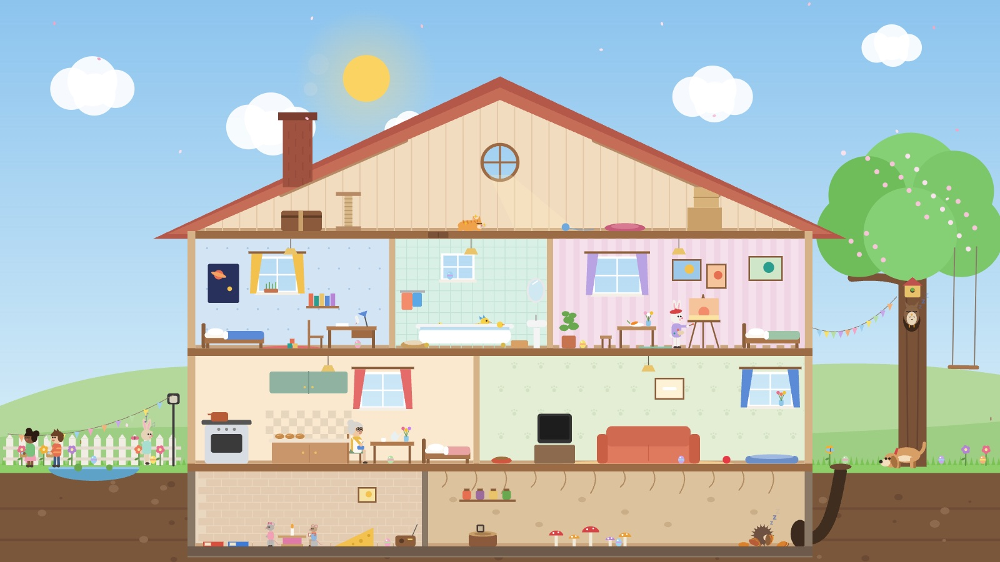
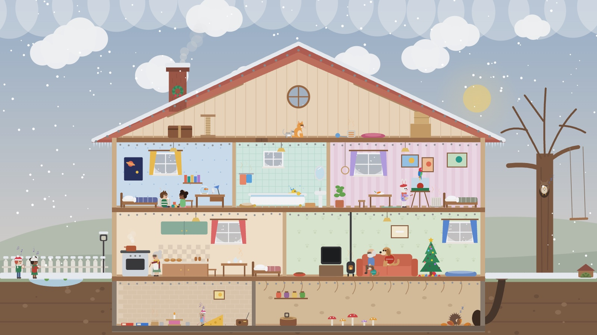
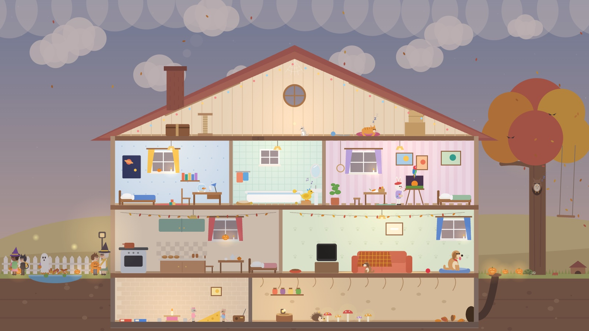

# Tiny Lives

A cozy little house where everyone has their own room, and a whole life story unfolds over the years. Everything is drawn with code in the browser, with a soft piano soundtrack.

**▶ Play it here: https://jessicathao.github.io/tiny-lives/**

🇻🇳 **Tiếng Việt:** https://jessicathao.github.io/tiny-lives/?lang=vi

[](https://jessicathao.github.io/tiny-lives/)

| Winter: snow, carolers and a festive tree | Autumn: Pumpkin Night with trick-or-treaters |
| --- | --- |
|  |  |

Also in this repo: **[Pencil Sonata](https://jessicathao.github.io/tiny-lives/pencil-sonata.html)**, a pencil drawing that plays its own piano tune.

> Click the play button and turn your sound on. Browsers only play sound after a click.

---

## What happens in Tiny Lives

A cutaway house with an attic, bedrooms, a kitchen, a den, a basement and gardens on both sides. Each resident has a daily routine that follows the clock.

**The family:** Leo (a kid who grows up), Nora the baker, Juniper the rabbit painter, Biscuit the dog, Miso the cat, Dot the duck, Pip & Squeak the mice, Bramble the hedgehog and Olive the owl.

- **Day and night:** the sun and moon cross the sky, lamps switch on at night, and residents wake, work, play and sleep.
- **Weather:** it changes by itself with the seasons: sun, clouds, rain, thunderstorms, and snow in winter. Puddles fill up, snow piles on the roof, lightning flashes, and a rainbow appears after rain.
- **Seasons:** blossoms in spring, fans and sunflowers in summer, falling leaves and pumpkins in autumn, radiators, a wood stove and string lights in winter.
- **Holidays:** a Spring Egg Hunt (click the hidden eggs!), Leo's Birthday Party, a Beach & Camping Weekend, Midsummer Fireworks, Pet Adoption Day, Pumpkin Night, the Winterlight Festival and a New Year's Eve countdown.
- **Everyday life:** school days with a school bus and a live classroom window, rainy-day board games in the den, snowy days building a family snowman, and housemates popping into each other's rooms to say hi or help out.
- **A life story:** Leo graduates and becomes an astronomer (year 4), meets Lily and her dog Daisy (year 5), gets married in the garden while Biscuit marries Daisy (year 6), and welcomes baby Poppy, along with puppies, ducklings and baby mice (year 7).

## How to play

| Control | What it does |
| --- | --- |
| Click a room | Zoom in (click again or press **Esc** to zoom out) |
| Click a resident | Say hi and hear their little tune |
| **1× / 4× / 12×** | Change how fast time passes (a day is 4 minutes at 1×) |
| **Morning / Noon / Evening / Night** | Jump to a time of day |
| **Spring … Winter** | Jump to a season |
| **Next holiday ▸** | Jump to the best moment of the next holiday |
| **School day ▸ / Rainy day ▸ / Snowy day ▸** | Jump straight to those days |
| **Life story ▸** | Jump to the next chapter of Leo's life |
| **Space** | Pause and resume |
| **EN / VI** | Switch between English and Vietnamese (Tiếng Việt) |

## Pencil Sonata

A pencil sketches a countryside scene stroke by stroke while a piano plays. The pencil's height on the page chooses each note, so the drawing makes its own melody. You can also **record it as a video** (.webm in Chrome, .mp4 in Safari).

## Run it on your own computer

There is nothing to install or build. Download the files and open `tiny-lives.html` (or `pencil-sonata.html`) in a web browser.

`index.html` is a copy of `tiny-lives.html` so the website opens straight into the game. After editing `tiny-lives.html`, update the copy and publish:

```bash
cp tiny-lives.html index.html
git add -A && git commit -m "Update" && git push
```

GitHub Pages refreshes the site about a minute later.

## Languages

The game is fully translated into **Vietnamese**: every speech bubble, activity, holiday, sign and menu. Use the **EN / VI** buttons in the toolbar. Players whose browser is set to Vietnamese get it automatically, and the choice is remembered. Share `?lang=vi` to open it straight in Vietnamese.

## How it's made

- Each game is a single HTML file with plain JavaScript and no libraries.
- All graphics are drawn on an HTML `<canvas>`, with no image files.
- All sound (piano, rain, thunder, fireworks, crickets, bus horn) is generated live with the Web Audio API, with no audio files.
- The only outside resources are the [Caveat](https://fonts.google.com/specimen/Caveat) font from Google Fonts and a [GoatCounter](https://www.goatcounter.com) script that counts visits and plays anonymously (no cookies, no personal data).

The melodies used ("Happy Birthday", "Auld Lang Syne", Wagner's "Bridal Chorus", "Twinkle Twinkle Little Star" and "Row, Row, Row Your Boat") are traditional or public-domain tunes.
